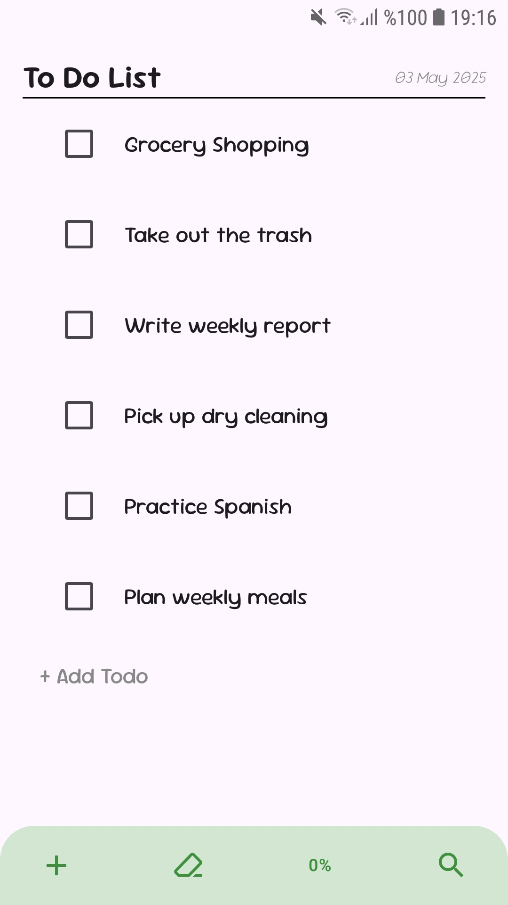
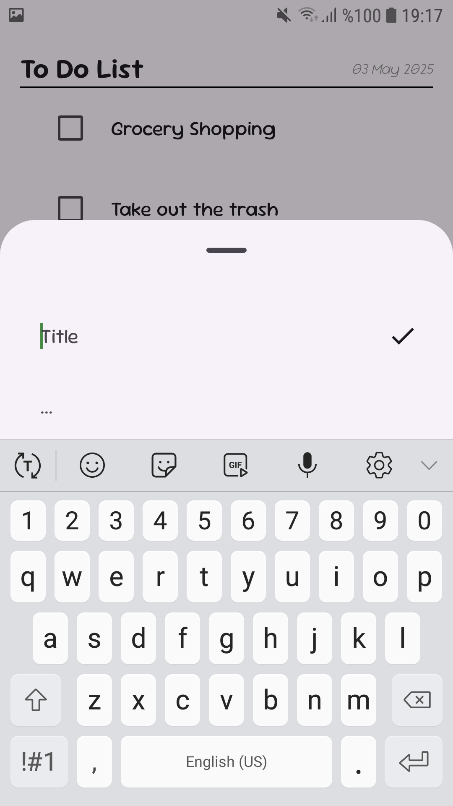
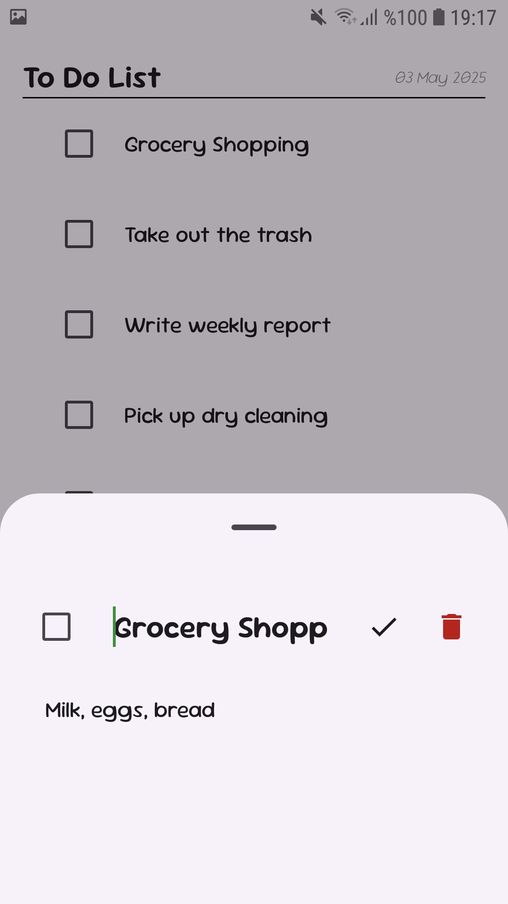
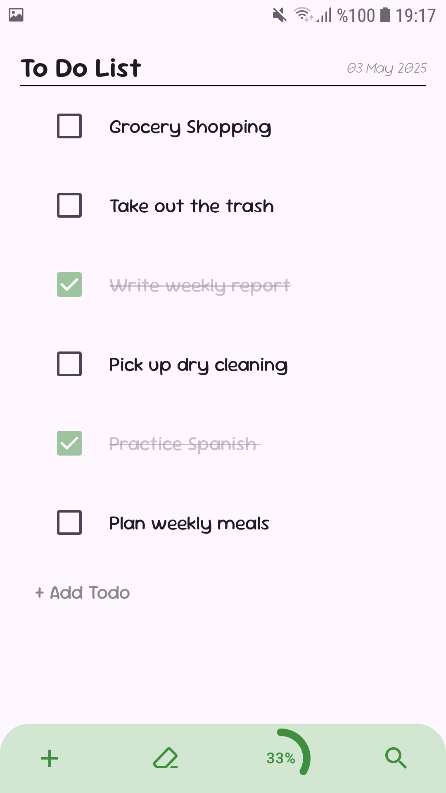
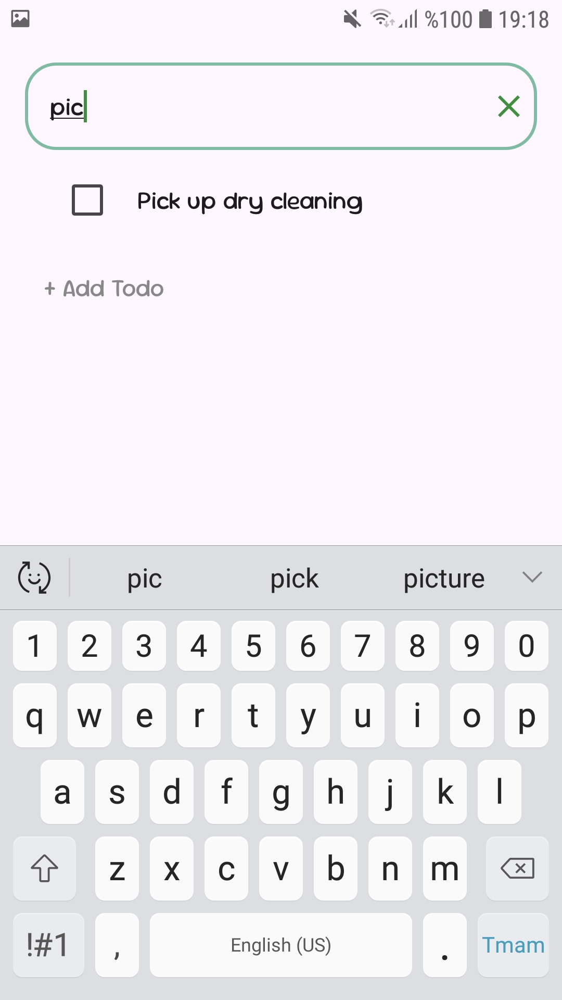
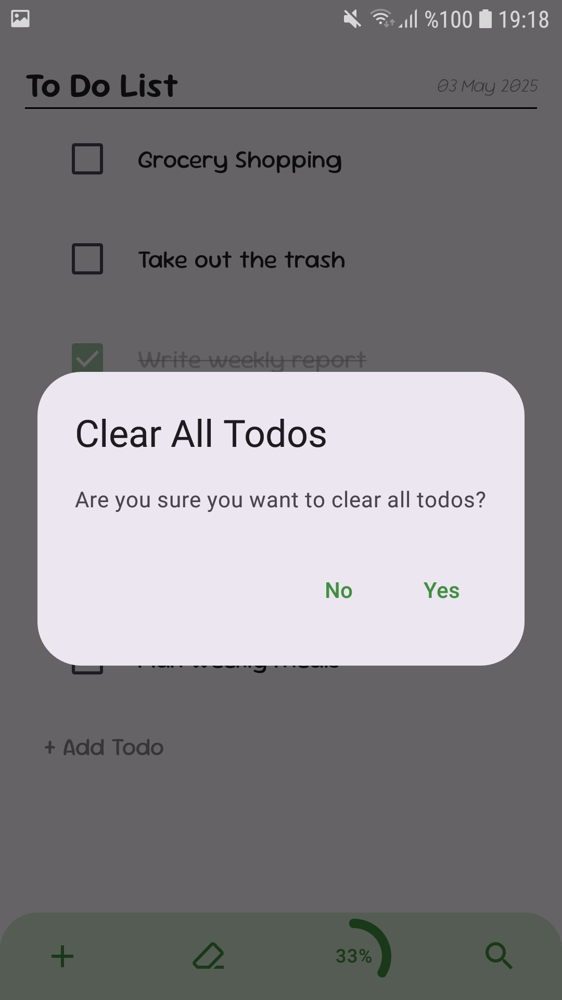

# Todo App

A modern Todo application built using Jetpack Compose, following the MVVM architecture. With a clean and responsive UI, it allows users to add, delete, and search to-dos.

## 🛠 Technologies Used

- **Jetpack Compose**
- **MVVM Architecture**
- **Room Database**
- **Hilt (Dependency Injection)**
- **Navigation Component**
- **StateFlow**
- **Material 3 Design**

## 📸 Screenshots

These images showcase various app features, including the todo list, add/edit actions, progress tracking, search functionality, and the option to clear all todos.

<table>
  <tr>
    <td></td>
    <td></td>
    <td></td>
  </tr>
  <tr>
    <td></td>
    <td></td>
    <td></td>
  </tr>
</table>

## 🤖 AI Integration (Coming Soon)

Future development will explore integrating AI features to help users:
- Get smart suggestions for to-do items
- Automatically organize and prioritize tasks
- Offer motivational quotes and reminders based on usage patterns

Stay tuned for updates!

---

